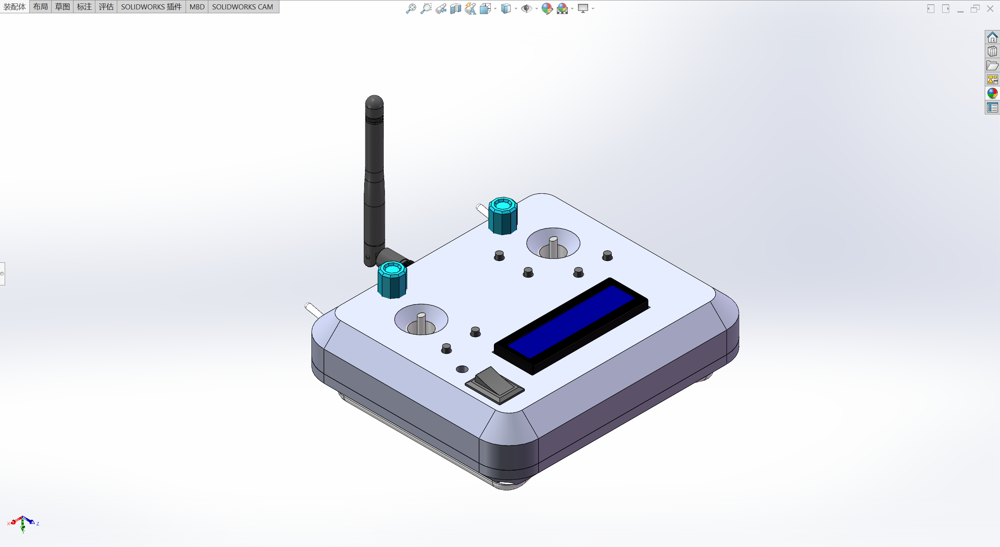
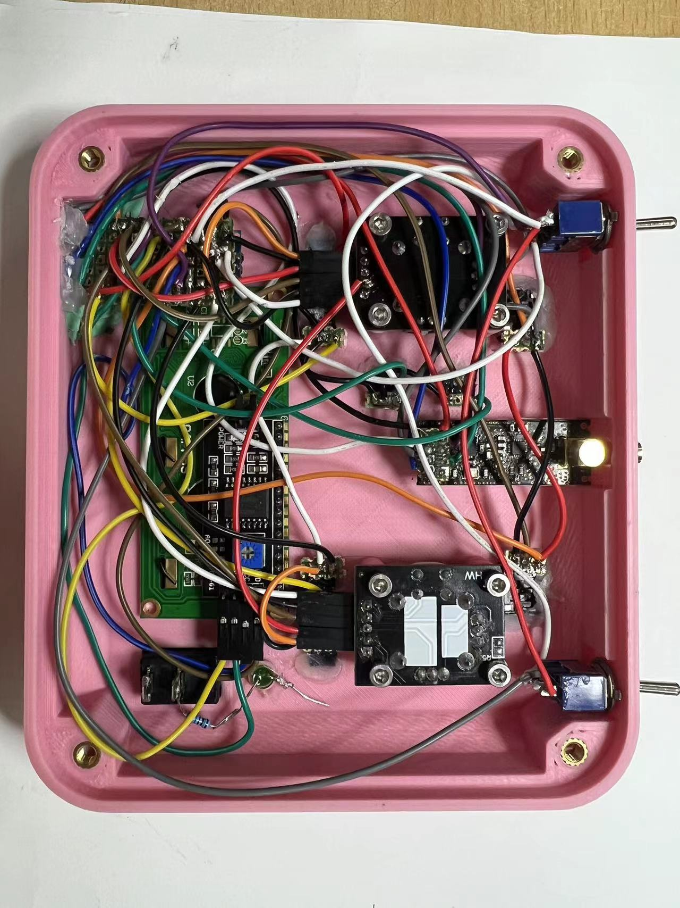

# Remote-control-handle

基于 nRF24L01 模块的远距离通讯以及遥控

## 1. 项目介绍

本项目是 2.4G 远距离遥控器的制作，基于 `Arduino` 框架开发。

模型使用的是`soildworks`制作。

## 2. 项目结构

- **code** 代码
- **lib** 库
- **part** 模型部件
- **assembly** 模型装配体
- **stl** 打印模型

## 3. 模型介绍

模型灵感来源于在 Youtube 上看到一位博主自制的遥控器，比较感兴趣，所以参考了一下他的模型

有兴趣的可以去看一看这个视频，链接如下

[Making a 2400 meters LONG RANGE 8-Channel & Digital Trim Radio Control For RC Models](https://www.youtube.com/watch?v=RSDfMaanKXM&list=WL)

### 3.1 模型设计思路

为了更加贴切于航模遥控器和满足人体工程学，制作的还是最简单的盒子式的遥控器。

也是为了方便后期电路的布局不允许正常布线，模型制作的比较简单。

应各位同仁爱好，使用主题颜色使用的粉色和灰色，更加符合我们技术部的猛男特色。

### 3.2 模型视图

- #### 整体视图



- #### 正面视图


- #### 背面视图（透视）


以上三种视图展示了模型整体的结构和各个原件的布局

### 3.3 模型爆炸视图

https://github.com/ptsfdtz/Remote-control-handle/assets/148436840/ea57b409-a363-41d5-a612-20af8ce92d28

展示拆分细节

## 4. 电路部分

### 4.1 模块介绍

- `EC11B15244 编码器`
- `KCD1-A 船型开关`
- `LCD1602 with I2C 显示屏`
- `MTS-10x-A2 微型切换开关`
- `XBOX360 线性可按压摇杆`
- `NRF24+SMA 无线接收器`

#### 4.1.1 EC11B15244 编码器


使用`EC11B15244`旋转编码器的案例通常涉及到读取旋转位置或旋转步数，主要用于位置检测，旋转方向检测，运动速度检测，步数计数，用户界面控制，电子设备调节。

在本项目中我们只使用到了其中的一部分功能。

下面是使用 arduino 的示例代码，使用`EC11B15244`需要连接电源以及输出引脚连接单片机的输入引脚，使用两个中断引脚连接到编码器的两个输出引脚，实现了在旋转时的位置计数。

```cpp
const int encoderPinA = 2;
const int encoderPinB = 3;

volatile long encoderPosition = 0;

void setup() {
  pinMode(encoderPinA, INPUT);
  pinMode(encoderPinB, INPUT);

  digitalWrite(encoderPinA, HIGH);
  digitalWrite(encoderPinB, HIGH);
  attachInterrupt(digitalPinToInterrupt(encoderPinA), updateEncoder, CHANGE);
  attachInterrupt(digitalPinToInterrupt(encoderPinB), updateEncoder, CHANGE);
  Serial.begin(9600);
}

void loop() {
  long newPosition = encoderPosition;
  if (newPosition != encoderPosition) {
    Serial.println(newPosition);
    encoderPosition = newPosition;
  }
}

void updateEncoder() {
  static byte encoder_A_prev = 0;

  byte encoder_A = digitalRead(encoderPinA);
  byte encoder_B = digitalRead(encoderPinB);

  if ((encoder_A == HIGH) && (encoder_A_prev == LOW)) {
    if (encoder_B == LOW) {
      encoderPosition++;
    } else {
      encoderPosition--;
    }
  }

  encoder_A_prev = encoder_A;
}

```

但是由于我们使用的单片机为 arduino nano，仅有两个中断引脚，所以不得不更换为电位器

电位器就是可调电阻，使用时可形成不同的分压


在代码中可以调整电位器值转换为角度范围，使用`map`函数实现，示例代码如下，通过数字引脚输入信号读取电位器的转动角度。

```cpp
const int potPin_L = A0;
const int potPin_R = A1;
void setup() {
  Serial.begin(9600);
}

void loop() {
  int potValue_L = analogRead(potPin_L);
  int potValue_R = analogRead(potPin_R);

  int angle_L = map(potValue_L, 0, 1023, 0, 360);
  int angle_R = map(potValue_R, 0, 1023, 0, 360);

  Serial.println(angle_L);
  Serial.println(angle_R);

  delay(100);
}
```

#### 4.1.2 LCD1602 with I2C


`i2c通讯`原理可以详见电子组培训文档[电子组培训文档-i2c 通讯原理](https://book.jinhun.moe/MCU-Communication/Serial/I2C/Intro.html)

在本项目中屏幕的主要功能是模式选择以及显示此刻遥控器的指令，以便于后期调试和用户的交互式体验。

我使用的是`LiquidCrystal`库[介绍文档](https://www.arduino.cc/reference/en/libraries/liquidcrystal/)

该库允许 Arduino 板控制基于 Hitachi HD44780（或兼容）芯片组的液晶显示器（LCD），该芯片组在大多数基于文本的 LCD 上都可以找到。

下面是示例代码，需要连接单片的的`SDA`和`SCL`引脚，使用 3.3v/5v 供电。

```cpp
#include <Wire.h>
#include <LiquidCrystal_I2C.h>

#define LCD_ADDRESS 0x27
#define LCD_COLUMNS 16
#define LCD_ROWS 2

LiquidCrystal_I2C lcd(LCD_ADDRESS, LCD_COLUMNS, LCD_ROWS);

void setup() {
  lcd.begin();
  lcd.print("Hello World");
}

void loop() {
  // 在loop中可以添加其他代码
}
```

#### 4.1.3 nRF24L01

我使用的是`nRF24L01+PA/LNA`的版本，除了天线外，它还有一个 RFX2401C 芯片，包括 PA（功率放大器）和 LNA（低噪声放大器）。 放大了 NRF24L01 信号，并在开放空间中实现了长达 1000 米的更好传输范围。

该模块可以使用 `125` 个不同的通道，从而可以在一个地方拥有 125 个独立工作的调制解调器网络。每个通道最多可以有 6 个地址，或者每个单元最多可以同时与 6 个其他单元通信,也就是说该模块可以同时控制其他六个设备。

以下是`NRF24L01`引脚排列以及 `NRF24L01+ PA/LNA` 模块的详细介绍。


##### **下面分别为接收端和发射端的接线图**


**发射端示例代码**

```cpp
#include <SPI.h>
#include <nRF24L01.h>
#include <RF24.h>

RF24 radio(7, 8); // CE, CSN

const byte address[6] = "00001";

void setup() {
  radio.begin();
  radio.openWritingPipe(address);
  radio.setPALevel(RF24_PA_MIN);
  radio.stopListening();
}

void loop() {
  const char text[] = "Hello World";
  radio.write(&text, sizeof(text));
  delay(1000);
}
```

**接收端示例代码**

```cpp
#include <SPI.h>
#include <nRF24L01.h>
#include <RF24.h>

RF24 radio(7, 8); // CE, CSN

const byte address[6] = "00001";

void setup() {
  Serial.begin(9600);
  radio.begin();
  radio.openReadingPipe(0, address);
  radio.setPALevel(RF24_PA_MIN);
  radio.startListening();
}

void loop() {
  if (radio.available()) {
    char text[32] = "";
    radio.read(&text, sizeof(text));
    Serial.println(text);
  }
}
```

**问题简介**

电源噪声是与 NRF24L01 模块成功通信时遇到的最常见问题之一。射频电路或射频信号对电源噪声很敏感。在电源线上加入一个**去耦电容**可以适当解决。电容器可以是 10uF 到 100uF 之间的任何值。

另一个问题是 Arduino 板的 3.3V 引脚不能始终为 NRF24L01 模块提供足够的电源。因此，也可以使用外部电源。


#### 4.1.4 线性按键摇杆

`ps2`手柄上的可按压摇杆使用非常的广泛而且十分的简便，无需安装其他库。

并且仅用一只手指即可以完成三种信号的输出，可操作性比其他的摇杆优势高。


`vRX`和`vRy`需要连接在模拟输入口，示例代码如下。

```cpp
const int xPin1 = A7;
const int yPin1 = A6;
const int buttonPin1 = 0;

const int xPin2 = A3;
const int yPin2 = A2;
const int buttonPin2 = 1;

void setup() {
  Serial.begin(9600);
  pinMode(xPin1, INPUT);
  pinMode(yPin1, INPUT);
  pinMode(buttonPin1, INPUT_PULLUP);

  pinMode(xPin2, INPUT);
  pinMode(yPin2, INPUT);
  pinMode(buttonPin2, INPUT_PULLUP);
}

void loop() {
  int xValue1 = analogRead(xPin1);
  int yValue1 = analogRead(yPin1);
  int buttonState1 = digitalRead(buttonPin1);

  int xValue2 = analogRead(xPin2);
  int yValue2 = analogRead(yPin2);
  int buttonState2 = digitalRead(buttonPin2);

  Serial.print(xPin1);
  Serial.print(" ");
  Serial.print(yPin1);
  Serial.print(" ");
  Serial.print(buttonPin1);
  Serial.print(" ");
  Serial.print(xPin2);
  Serial.print(" ");
  Serial.print(yPin2);
  Serial.print(" ");
  Serial.println(buttonPin2);
  delay(100);
}
```

## 5. 功能简介

### **实物视图**

- 正面视图


- 背面视图（忽略我粗糙的理线）



### **视频展示**

https://github.com/ptsfdtz/Remote-control-handle/assets/148436840/af519cdb-0244-4dc7-bf22-2b7f280e0448

